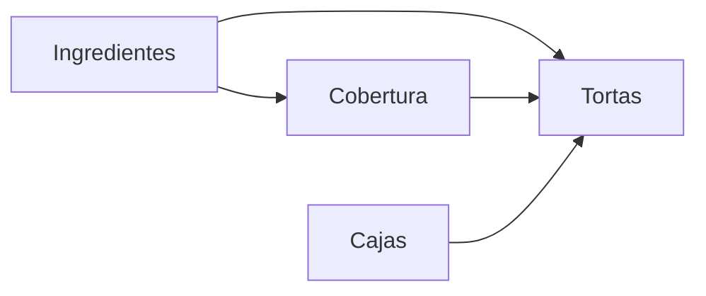

### Problema 33

#### Tabla de Contenido

- [Problema 33](#problema-33)
  - [Tabla de Contenido](#tabla-de-contenido)
  - [Enunciado](#enunciado)
  - [Análisis de la situación problemática](#análisis-de-la-situación-problemática)
  - [Objetivo](#objetivo)
  - [Hipótesis y Supuestos](#hipótesis-y-supuestos)
  - [Definición de Variables](#definición-de-variables)
  - [Modelo de Programación Lineal Continua](#modelo-de-programación-lineal-continua)
    - [Constantes](#constantes)
    - [Modelo](#modelo)
  - [Resolución por software](#resolución-por-software)
    - [Solución](#solución)
  - [Informe de Resultados](#informe-de-resultados)

<!-- pagebreak -->

#### Enunciado

Una empresa de catering produce y comercializa tres tipos de torta.

- La torta tipo **A** requiere
  - **1 kg** de **harina**,
  - **500 gramos** de **azúcar**,
  - **400 gramos** de **chocolate**,
  - **6 huevos**
  - y **200 gramos** de **dulce de frutillas**.
- La torta tipo **B** requiere
  - **1,5 kg de harina**,
  - **600 gramos** de **azúcar**,
  - **500 gramos** de **chocolate**.
  - **6 huevos** y
- La torta tipo **C** requiere
  - **800 gramos** de **harina**,
  - **400 gramos** de **azúcar**,
  - **4 huevos** y
  - **400 gramos** de **dulce de frutillas**.

Las tortas “A” y “B” llevan además una **cobertura especial**.
La mezcla para coberturas lleva un

- **20% de chocolate**,
- **entre 40% y un 60% de crema**
- y el resto de **dulce de leche**.
  La torta “A” lleva **200 gramos** de cobertura y la torta “B” lleva **250 gramos** de esta cobertura.

Por último, las tortas se guardan en **cajas decoradas**, de las que se puede disponer de **300** por semana.

**Semanalmente**, se puede disponer de

- 500 kg de harina
- 200 kg de azúcar
- 120 kg de chocolate
- 150 docenas de huevos
- 40 kg de dulce de frutillas
- 30 kg de crema
- 15 kg de dulce de leche.

Se ha calculado que el beneficio de cada torta es el siguiente:

- Tortas “A”: 20 pesos
- Tortas “B”: 25 pesos
- Tortas “C”: 12 pesos.

<!-- pagebreak -->

#### Análisis de la situación problemática

Podemos ver la composición de las tortas como un problema de armado
y la cobertura como un problema de mezcla

#### Objetivo

- que ? determinar:
  - cantidad de cajas con cada tipo de torta a armar
  - proporciones de cada ingrediente en la cobertura especial
- para que ? maximizar la ganncia
- cuando ? por semana

#### Hipótesis y Supuestos

- No hay costos ni contratiempos mas allá de los mencionados y se poseen todos los recursos necesarios `Certeza`
- Las tortas , los ingredientes y las cajas son arbitrariamente fraccionables `Proporcionalidad`
  > Cualquier Torta fraccionada se completa en los periodos siguientes
- No hay stock inicial ni final

#### Definición de Variables

- `var tortas{ t in tipoTorta } >= 0;`

  > cantidad de cada torta de cada tipo producido

- `var cobertura >= 0;`

  > kg de cobertura producidos

- `var cobertura_{ i in ingrediente_cobertura} >= 0;`

  > kg de cada ingrediente utilizado en la cobertura

<!-- pagebreak -->

#### Modelo de Programación Lineal Continua

##### Constantes

@import "data.dat" {as="java"}

<!-- pagebreak -->

##### Modelo

@import "model.glpk" {as="java"}

#### Resolución por software

##### Solución

@import "solution.glps" {as="java"}

#### Informe de Resultados

El modelo recomienda:

Armar `230` tortas por semana:

- 0 de tipo A
- 130 de tipo B
- 100 de tipo C

Para lo que se produciran `32.5` kg de cobertura, utilizando:

- `6.5` kg de chocolate
- `13` kg de crema
- `13` kg de ddl

Los ingredientes limitantes son:

- crema
- dulce de frutilla
