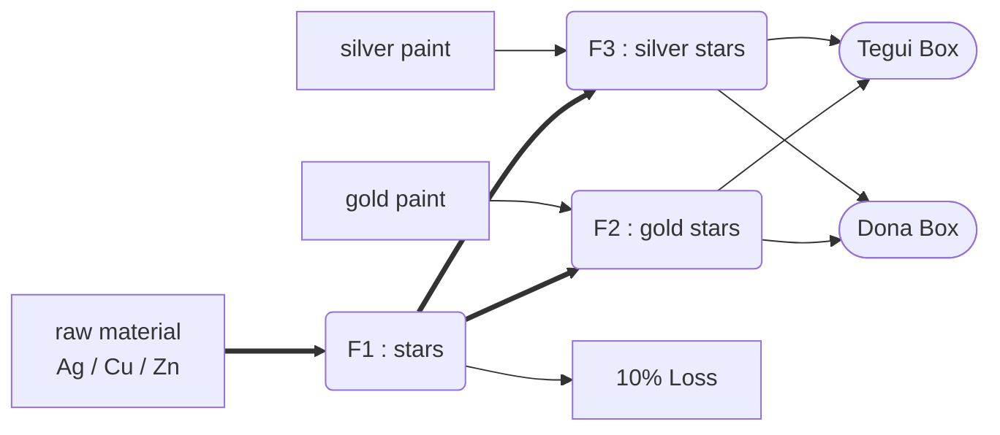

## Class 2

<input type="date" value="2022-03-30" />

### Introduction

- Basic Assumptions of Continuos Lineal Programming
- Practical Cases (G2)
  - Assembling (? Armado)
  - Mixing (? Mezcla)

###### Notes

- We can no longer solve graphicaly, we'll need software
- Still we need to understand how to correctly model our problem
- The solution will give extra info

### Basic Assumptions

- **Proportionality** : Both the benefit and use of resources are directly proportional to the **activity level**
  - _neg._ fixed costs or non lineal relations
- **Additivity** : There are no interactions between the activities that change the total measure / effectivity / use of any resource
  - _neg._ some chemical reactions
- **Divisibility** : Activity variables may be arbitrarily fractioned ( continuous variables )
- **Certainty** : All the parameters of the model are known constants

> If variables are not linear, the solution time is not bounded

### Assembling vs Mixing

#### Example Model



> F1: productive transformation

##### Objective

- Determine the amount of boxes ( Tegui / Dona ) to be produced & How much raw material ( Ag / Cu / Zn ) to buy
- each week
- to maximize earnings

##### Hypothesis

- No defective products
- All that is produced is sold
- Machine times are net hours, time is fully utilized
- Demand is : minimum / maximum ( choose one )
- Productive Capacity is measured at input ( rather than output )

##### Restrictions

###### F1

Mixing:

1. Ag >= 0.9 · ( Ag + Cu + Zn)
2. Ag <= 0.005 · ( Ag + Cu + Zn)
3. 0.9 ( Ag + Zn + Cu ) [kg/w] = 0.15 [kg/s] · Stars [s/w]

> This process is a mix !

Production:

4. Stars = StarsF2 + StarsF3

Productive Capacity:

5. Ag + Cu + Zn <= A [kg/h] · 48 [h/w]

> Alternatives
>
> 1. 0.9 Ag [kg/w] >= 0.9 · 0.15 [kg/s] · Stars [s/w]
> 2. 0.9 Zn [kg/w] >= 0.005 · 0.15 [kg/s] · Stars [s/w]

###### F2

6. StarsF2 = GoldStars
7. GoldPaint [l] = 0.01 [l/s] · GoldStars
8. StarsF2 <= B [kg/h] · 48 [h/w]

###### F3

9. StarsF3 = SilverStars
10. SilverPaint [l] = 0.02 [l/s] · SilverStars
11. StarsF3 <= C [kg/h] · 48 [h/w]

###### Raw Materials

12. Ag <= D
13. Cu <= E
14. Zn <= F
15. GoldPaint <= G
16. SilverPaint <= H

###### Boxes

17. GoldStars = 3 · Tegui + 1 · Dona
18. SilverStars = 2 · Tegui + 4 · Dona

> Tegui box has 3 gold stars & 2 silver stars
> Dona box has 1 gold stars & 4 silver stars
> This Process is an Assembly !

###### Demand ( Maximum )

19. Tegui <= A2
20. Dona <= A3

##### Earning ( Functional )

```
Z (max) =
  + Tegui · A1 + Dona · A2
  - P1 · Ag - P2 · Cu - P3 · Zn
  - P4 · GoldPaint - P5 · SilverPaint
```

### Other Notes

- Models should be sufficiently abstract, taking the objective into account
- Convert the smallest unit to the largest one
- Make no previous calculations, let the model do the job
  - Discarding a variable that is later important due a change in the situation would mean having to re-do the model
